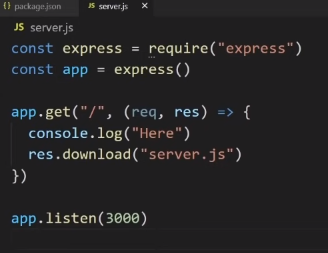

## Express-Crash-Course

WebDevSimplified 35 min crash course..

`npm init -y`
`npm i express`

### Introduction

### Project Setup
`npm run devStart`

### Basic Routing
need to have routes setup
`app.<request.type>`
app.post
app.get

`res.download('path-to-file')` instantly downloads...

### Rendering html
`res.render('index)`
you can't just render straight
you need a view engine to be set up.

have to resave file as `index.ejs`
using `ejs` view engine...
``npm install ejs``
boiler plate that you MUST use.
`app.set('view engine', 'ejs')`

you can pass info from server to the view
`res.render` takes a second parameter
to access ejs (templating language)s

this is how you access those vairables..
`<%= locals.text4 || 'Default' %>`

we've talked about rendering json common for apis
downloading different files

what happens if we have a lot of routes...?

