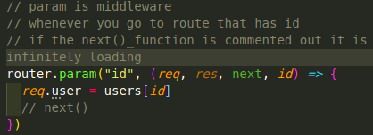
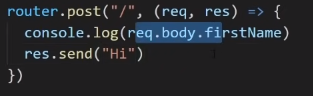

## Express-Crash-Course

WebDevSimplified 35 min crash course..

`npm init -y`
`npm i express`

### Introduction


### Project Setup
`npm run devStart`

### Basic Routing
need to have routes setup
`app.<request.type>`
app.post
app.get


`res.download('path-to-file')` instantly downloads...


### Rendering html
`res.render('index)`
you can't just render straight
you need a view engine to be set up.

have to resave file as `index.ejs`
using `ejs` view engine...
``npm install ejs``
boiler plate that you MUST use.
`app.set('view engine', 'ejs')`

you can pass info from server to the view
`res.render` takes a second parameter
to access ejs (templating language)s

this is how you access those vairables..
`<%= locals.text4 || 'Default' %>`

we've talked about rendering json common for apis
downloading different files

what happens if we have a lot of routes...?


### Implementing Routers
create folder
/routes where it contains everything
index for all different routes

you have to set up a mini application

`module.exports = router`
- export from /routes/users.js
- import to server.js


router post request
dynamic parameter
id


don't have /new below the /:id
because it might have new as the ID

chain together all the requests for a single route.

### Advanced Routing


it is infinitely loading if we don't use the next function..
so if there's any middle processes that have to be executed between the get request and the sent response, middleware is the way to go.


Might also try and store the request variable.


Well came across converting circular structure to JSON
[circular structure conversion error](https://stackoverflow.com/questions/4816099/chrome-sendrequest-error-typeerror-converting-circular-structure-to-json)

### Middleware
but okay guess I cannot send back the request back to the browser...

you only ever see `next()` when using middleware

define middleware at the top of the page

when I rename any html file to `index.html` it overtakes the '/' route

you can also have logger function in the middle right before the (req, res)


### Rendering Static HTML Files
serve a basic html files...
```
http://localhost:3000/test/tt.html

you can access them directly
static webpages, like from web1

http://localhost:3000/index2.html
```

### Form Parse
http://localhost:3000/users/new



by default express.js doesn't allow you to access the body.

Instead you use middleware to do that...

check if the name is valid...
and then re-render the form if not valid.

but if valid, redirect to new user route.

### send json information
json request
fetch from client to server...


### query parameteres

get name from query string.